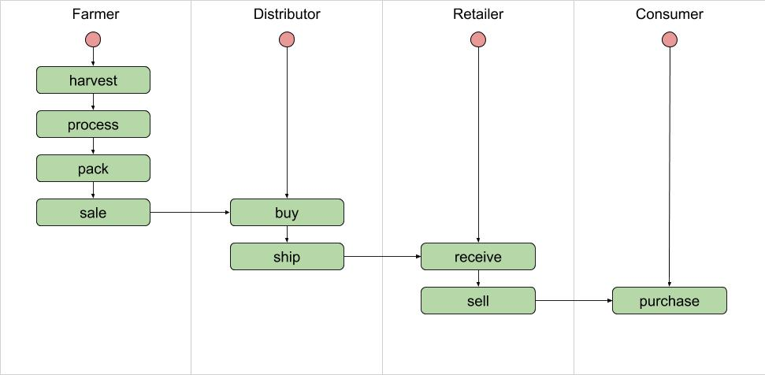
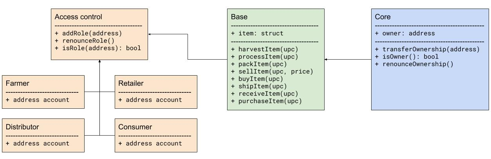
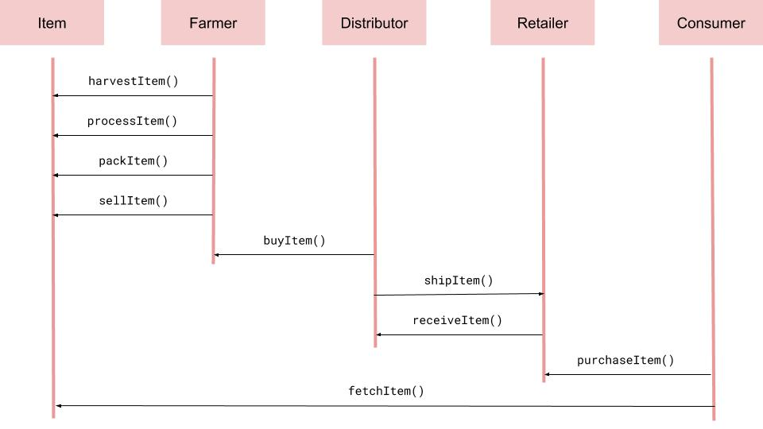
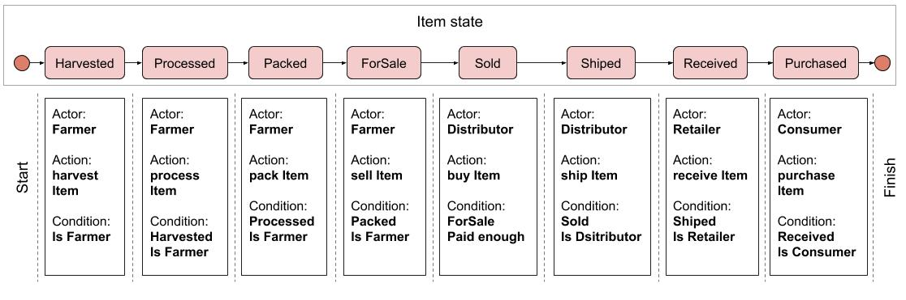

##### Udacity Project 3: Ethereum Dapp for Tracking Items through Supply Chain

# Supply chain & data auditing

This repository contains an Ethereum DApp that demonstrates a Supply Chain flow between a Seller and Buyer. The user story is similar to any commonly used supply chain process. A Seller can add items to the inventory system stored in the blockchain. A Buyer can purchase such items from the inventory system. Additionally a Seller can mark an item as Shipped, and similarly a Buyer can mark an item as Received.

## Getting Started

These instructions will get you a copy of the project up and running on your local machine for development and testing purposes. See deployment for notes on how to deploy the project on a live system.

### Prerequisites

Please make sure you've already installed ganache-cli, Truffle and enabled MetaMask extension in your browser.

### Installing

A step by step series of examples that tell you have to get a development env running

Clone this repository:

```
git clone https://github.com/udacity/nd1309/tree/master/course-5/project-6
```

Change directory to ```project-6``` folder and install all requisite npm packages (as listed in ```package.json```):

```
cd project-6
npm install
```

Launch Ganache:

```
ganache-cli -m "spirit supply whale amount human item harsh scare congress discover talent hamster"
```

In a separate terminal window, Compile smart contracts:

```
truffle compile
```

This will create the smart contract artifacts in folder ```build\contracts```.

Migrate smart contracts to the locally running blockchain, ganache-cli:

```
truffle migrate
```

Test smart contracts:

```
truffle test
```

All 10 tests should pass.

In a separate terminal window, launch the DApp:

```
npm run dev
```

## Built With

* [Ethereum](https://www.ethereum.org/) - Ethereum is a decentralized platform that runs smart contracts
* [IPFS](https://ipfs.io/) - IPFS is the Distributed Web | A peer-to-peer hypermedia protocol
to make the web faster, safer, and more open.
* [Truffle Framework](http://truffleframework.com/) - Truffle is the most popular development framework for Ethereum with a mission to make your life a whole lot easier.


## Authors

See also the list of [contributors](https://github.com/your/project/contributors.md) who participated in this project.

## Acknowledgments

* Solidity
* Ganache-cli
* Truffle
* IPFS


## Contract

address (rinkeby) = 0xeBc3C7248E66984A90879053b6fa6397152eA7aA

tx (rinkeby) = 0xf83b99174a376a2beef5739d0fc8319114de94330228801185f68e16c371df93


## Versions

Program version numbers: 2

Truffle v5.0.42 (core: 5.0.42)

Solidity v0.5.8 (solc-js)

Node v10.17.0

Web3.js v1.2.1


## How to use

### Add Role

Before, assign addresses to each Role from contract owner address.

Enter address in `Role Address` input and click button `Farmer` to add Farmer
Role to this address .

The same for other Rolers: `Distributor`, `Retailer`, `Consumer`.

### Supply chain

1. Need specify item's information. Enter `UPC`, `Farm Name`,
`Farm Information`, `Farm Latitude`, `Farm Longitude`, `Product Notes`.

2. If you want to upload image of item to ipfs, you need select `Choose File`
in section `Image Address` and wait until image address will be appeared.

3. Choose farmer address in metamask and click button `Harvest`. Wait until
event `Harvested` will arrive.

4. The same for buttons `Process`, `Pack`.

5. If you ready to sell item, you need specify `Product Price, ETH` and click
button `For Sale`.

6. Choose distributor address in metamask and click button `Buy`.

7. To ship the item click button `Ship`.

8. Retailer must use own wallet and click button `Receive` when item will arrive.

9. Consumer can purchase item, should click `Purchase`.

10. To fetch information about item, open logs and click buttons `Fetch Data 1`
 and `Fetch Data 2`.

### Diagrams








